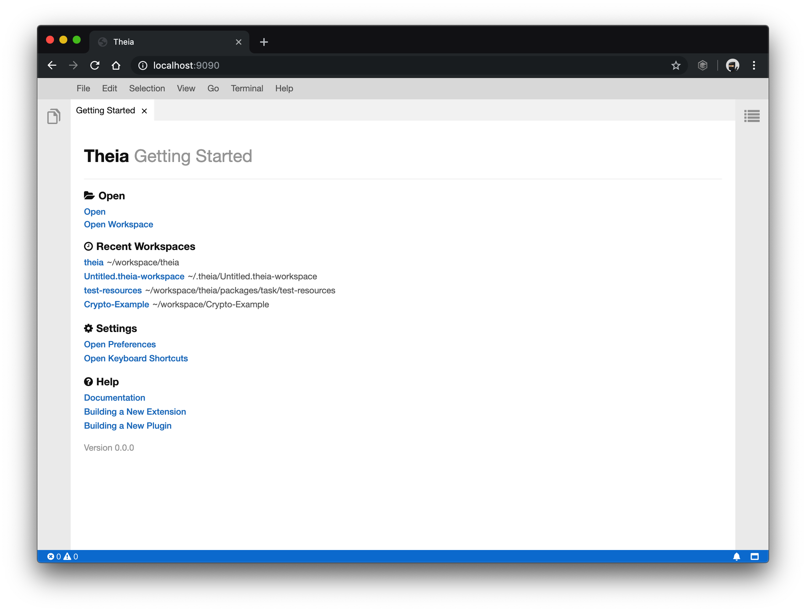
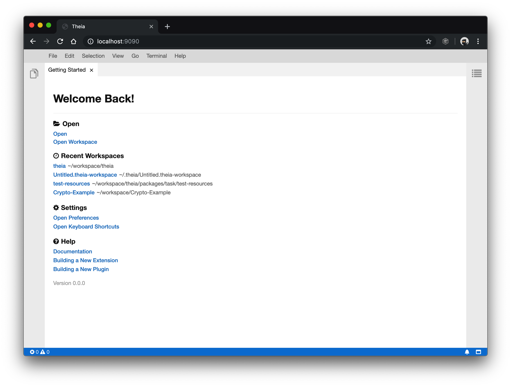

<div align='center'>
<br />


<h2>ECLIPSE THEIA<br/>EXAMPLE CUSTOM GETTING-STARTED EXTENSION</h2>

</div>

## Overview

The repository is an example of how an extension developer can make use of Theia's extension mechanisms (using `Dependency Injection) in order to customize pre-existing extensions/widgets easily. More information regarding dependency injection can be found [here](https://theia-ide.org/docs/services_and_contributions/).

The following `custom-getting-started` widget extends the base
[`getting-started`](https://github.com/eclipse-theia/theia/blob/master/packages/getting-started/src/browser/getting-started-widget.tsx) widget and updates the method `renderHeader()`.

Below is the comparison of the widget between both versions:

| Default `getting-started` | Custom `getting-started` |
|:---:|:---:|
| |  |

## Setup

The project was initially scaffolded using the Theia [yeoman generator](https://github.com/theia-ide/generator-theia-extension).

## Build

The extension can be built using the following command:

```bash
yarn
```

## Run

The extension can be run by executing the following command:

**browser**

```
yarn start:browser
```

**electron**

```
yarn start:electron
```

## License

- [Eclipse Public License 2.0](http://www.eclipse.org/legal/epl-2.0/)
- [一 (Secondary) GNU General Public License, version 2 with the GNU Classpath Exception](https://projects.eclipse.org/license/secondary-gpl-2.0-cp)

## Trademark
"Theia" is a trademark of the Eclipse Foundation
https://www.eclipse.org/theia
